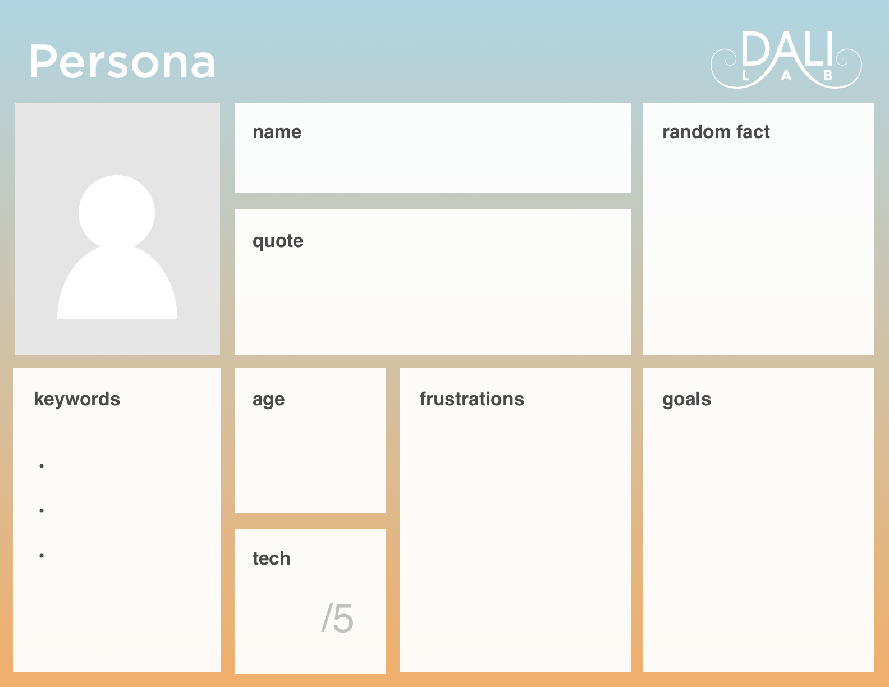

## Research and Code Experiment

Take time in Week 2 to research products and users, and create personas. Conduct code experiment 0.

### PM:
* [ ] Define long-term project goals
* [ ] Define detailed goals for the next three weeks
* [ ] Set up User Research for next week
* [ ] Follow up with partner on any pending questions and needs

### Dev:
* [ ] [Code Experiment 0](code-experiment-0.md)

### Des:
* [ ] [User Research](user-research.md)
* [ ] [Current-State User Journey](current-state-user-journey.md)

### Everyone:
* [ ] [Personas](#personas)

## Personas
Personas are hypotheses informed by our research. They capture basic demographics, motivations, and frustrations. The purpose of Personas is to inspire empathy which is the key to understanding irrational responses.

Aim for 2-4 personas that accurately describe the variety of users that will use your product.

Consult this template to fill in details about your users. Feel free to include any additional dimensions that help you think about and understand your user in relation to your project (e.g., knowledge, skills, interest, technique, languages, platform, etc.)

* Quote: pick a key moment to describe their character, their emotions, or their experiences
* Random Fact: add something real, humanizing, and quirky
* Keywords: a quick summary of standout personality traits, especially tags that might heavily affect design decisions
* Age: hints at a mindset based on current life phase, generation, and their cultural and economic experiences
* Tech-savviness: the lower the number, the more critical it is to make the design intuitive
* Frustrations: what must be fixed to improve the user experience
* Goals: what the users want to achieve in life – what motivates them
