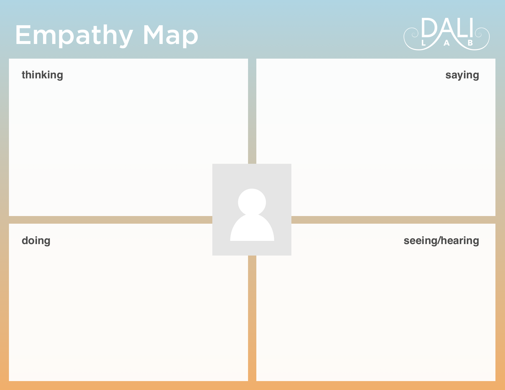

Determine your users (your partner might have provided a few types in the Kickoff Meeting). Uncover the user needs and pain points, ultimately helping you design for the user.

It’s not always easy to find users, let alone interview them. But the more end users you talk to, the more likely you are to have a successful project. Determine who you will get answers from, and how you will go about it.

* Interview: This can be 1 on 1 or a small group of users. The smaller the environment, the more likely they are to share antidotes.
* Survey: For a larger sample, and anonymous responses.
* Ask the partner: They know their target user, and might have some people already available to contact.
* Workshop: For an extra challenge (and a fun time!), consider conducting a “Co-Creation” Workshop and invite the users to discuss and solve their own problems.

Research questions to keep in mind:
* what are the users trying to do?
* how are they currently doing it?
* what problems or frustrations do they experience?
  * be sure to probe to get to the WHY
* what do users need to achieve their goal?

Restrict yourself from asking leading questions and looking for confirmation of your personal opinions.

## Use this Template
To make your life easier, the Design Resident made a [User Research + User Testing Template](https://docs.google.com/spreadsheets/d/1gKQyrXQKgv_zLd7S20WOh8IB6I9i2WX_XkQ5Kq0MYDk/edit?usp=sharing) for you. Copy the sheet to your Drive and populate with your specific questions. Use the *first tab* for User Research and reference the *second tab* for User Testing (in week 4).

## Empathy Maps
are a great way to visualize a user's emotions and get the team on the same page. According to the Nielsen Norman Group, it also ["reveals any holes in existing user data"](https://www.nngroup.com/articles/empathy-mapping/).

Make one Empathy Map per user interviewed to articulate what you learned, and help team members understand the user’s mindset. Populate the spaces based on the impression you got from the interview, not from direct questioning.

## Term 2 Additions:

* User Testing:
  * [ ] After conducting the user research, keep the users to conduct additional rapid user testing of the previous designs (follow [Rapid User Testing](rapid-user-testing.md) for guidelines)
