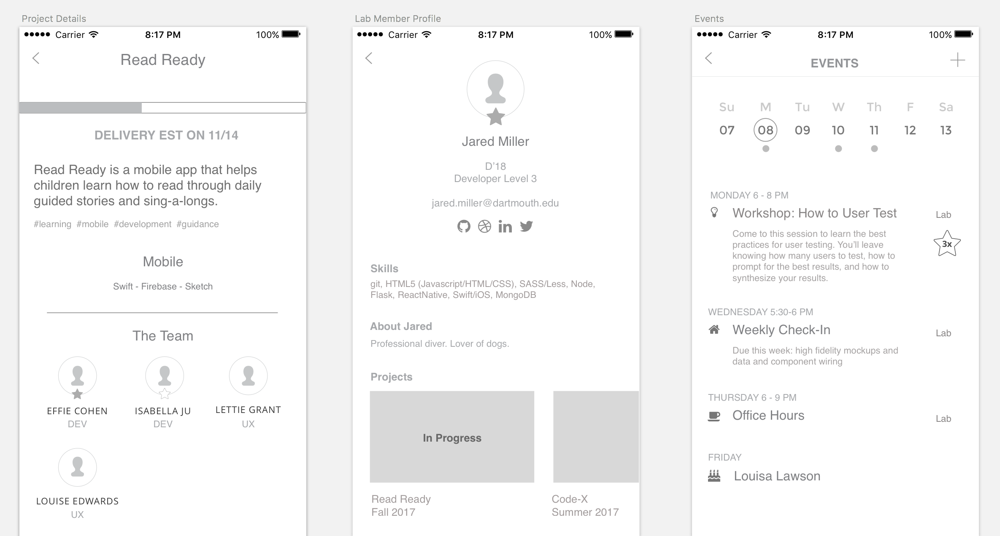

Once you have feedback from your partner on your sketches, start to *narrow down your designs and add detail*.

Grayscales™ are *GRAY*. Leave out any color or any visual treatments, because ideas still can be scrapped and started again. We don’t want to waste any time with making it pretty.

Prepare to **iterate** as you determine the best way to display information, work through a flow, or integrate content. Refer back to your Competitive/Comparative for inspiration and interface examples.

#### Teamwork:
1. Work as a team in **ONE (1) Figma project**.
  * Moving to a design tool will make prototyping faster (yay copy-paste and versioning!), allow comments, and integrate with Zeplin.
  * This means one URL, one link, one source of truth for all designs and designers on the project.
  * Use shared symbols wherever possible to minimize work down the line when updating elements.
2. **Keep all process artboards in this Figma project**.
  * Just make a note that it is **PROCESS** somewhere at the top of that area, and move it to the side.
  * This will help you explain how you arrived at a solution, if asked about a particular approach.

#### Feedback:
1. On the pages that you want to share and get feedback on, mark them with a **FOR FEEDBACK** title.
2. Next to or below each page you want feedback on, **write a few comments** to help the reviewer understand:
  * What you feel is working on this page / what you’re happy about
  * What you feel needs work on this page
  * A question or two for another designer to help you with (can be UX or UI related)
     * i.e. “I’m not sure if this is the best treatment of these elements” or “I can’t seem to find the right shade of green”
3. When showing the work, use the “Play” feature (top right) to make the pages nice and large for your reviewer and then use the **“*comment - C*” button** (top left) to leave a specific note in a specific place

## Guidelines:  
*   **Design for each unique page.**
  * Complex states of those pages can come later in mockups.
  * Mid-fidelity Grayscales™ should include:
    * real-ish content wherever possible (don’t let a content problem hold you back from more designing, but the more realistic the content, the more intelligent you can be with design decisions).
    * DO NOT USE Lorem Ipsum. This leads to space mis-estimation. Make up and synthesize words you think are good enough.
    * DO NOT worry yet about fonts, colors, grid systems, or design elements (i.e. use a basic font like Avenir, three shades of gray, and boxes for images or video placeholders).
*   Use the **Prototyping tab** to connect pages for testing.
  * If you have multiple versions of a page, you can A/B test these (make two separate prototypes and see what users like better)

