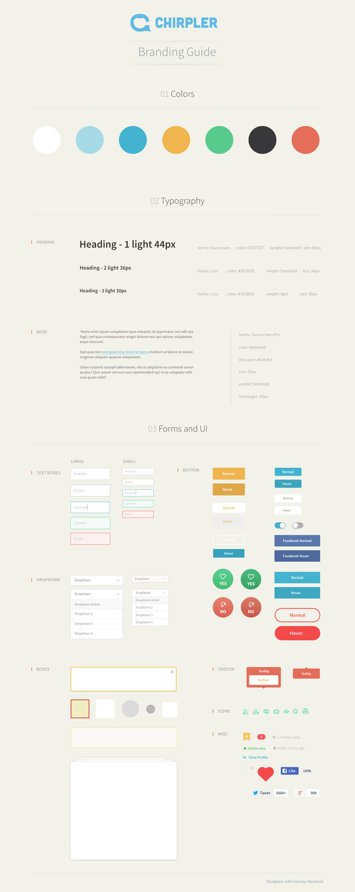

The earlier you settle on a style guide, the better, since this is the document that determines the look and feel of the project.
Decide on color, fonts, and grid before working on the bulk of your High Fidelity Mockups.
Continue to update as you make final decisions in context.

Begin to create Symbols or Components in your design library so you can easily apply changes to your entire design right from your Style Guide. The more connected you are with your Style Guide early on, the better.
Some tips on [setting up this system](https://medium.com/ux-power-tools/5-things-to-do-before-you-start-your-next-design-file-in-sketch-or-preparing-your-design-mise-en-ff7ea9fe3722).

* Color:
  * **Include swatches with hex codes, and gradients (if any)**
  * 60-30-10 Rule: 60% is your dominant color, 30% is secondary, and 10% is the accent.
  * Be extra careful of color contrast when choosing a [Dark Theme](https://dribbble.com/erikdkennedy/buckets/160688-Dark-themes)
  * Never use pure black
  * A nice [gradient finder](uigradients.com)

* Typography:
  * **Include the name of the typeface, sizes, styles, and colors**
  * Start here on [learning font design](https://www.canva.com/learn/font-design/)
  * Read up on everything related to [typography](https://practicaltypography.com/)
  * Be cautious about mixing Serif (Formal, Old, Wise, Classy) with San Serif (Modern, Simple, Clean)
  * Find your font using Font Kits
    * [Google Fonts](https://fonts.google.com/) - The largest repository of completely free fonts in the world
    * [Typekit](https://typekit.com/) - Adobe's font service, free with an Adobe Creative Cloud account
  * Determine the character sizes with the [Modular Scale](http://www.modularscale.com/)

* [Grids](https://spec.fm/specifics/8-pt-grid) most commonly made in multiples of 8 (because most devices are divisible by 8)
  * Full Width: A full-width design is edge-to-edge of the screen.
  * Floating: A floating design adheres to a fixed-width grid (typically centered).
    * Use this equation to determine the fixed-width grid: **(12 Columns x Column Width) + (11 Gutters x Gutter Width) = Total Layout Width**
    * Make sure your gutters and columns both divisible by 8.
    * NOTE: The default Nudge+Shift distance in Sketch is 10px. Not great when you’re working on an 8px grid. Change that to 8px in preferences.

  * Spacing: use the same nudge increment for vertical spacing between elements.

Most importantly:
  * Only use colors in your palette
  * Only use text styles you created
  * Always conform to your grid

If you're creating a [Design System](https://blog.prototypr.io/design-system-ac88c6740f53), refer to guides from existing systems for help.
  * [Google Material Design](https://material.io)
  * [Apple Design](https://developer.apple.com/design/resources/)

Examples:

