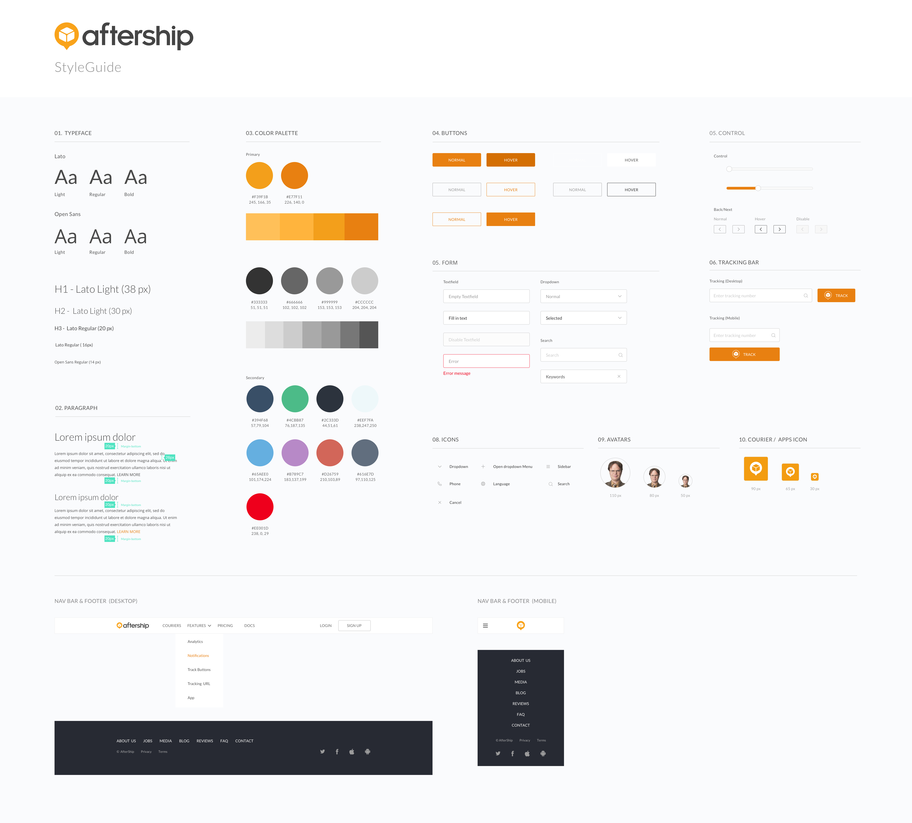

The document that determines the look and feel of the project. Continue to update as you make final decisions in context.

Benefits:
  * Outline the color, fonts, spacing, and some UI elements
  * A great **resource** to reference for High Fidelity Mockups

Rules:
  * Work with Symbols or Components so you can easily apply changes to your entire entire design file
    * Some tips on [setting up this system.](https://medium.com/ux-power-tools/5-things-to-do-before-you-start-your-next-design-file-in-sketch-or-preparing-your-design-mise-en-ff7ea9fe3722)

## Mandatory Style Guide Elements:

* Color:
  * Swatches with hex codes of all colors
    * Indicate which are Primary and which are Secondary
  * Gradients (if any)
    * Rules around where gradients can be used

* Typography:
  * The name of the typefaces, sizes, styles, and colors
    * Specify which combination you are using for your H1, H2, H3
    * Specify your Paragraph styles

* UI Elements:
  * Buttons
    * Primary and Secondary, with hover states and inactive states

* Additional specific elements
  * Forms
    * Textfield, dropdown, search bar (active and inactive)
  * Icons
    * Project-specific UI Icons and sizes

Examples:

