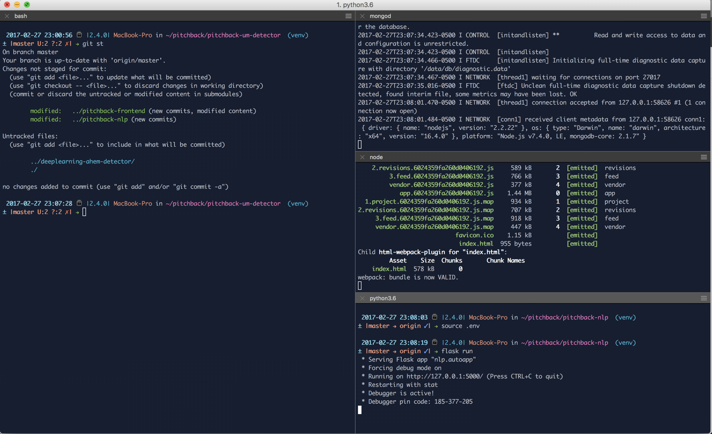

##### A guide to a variety of tools, technologies, and starter packs that are helpful for devs to improve their workflow

These are mostly for OS X but all are available on linux and, well, if you use Windows then you should talk to a staff person – we have loaner Macs!

Note: any `code blocks` are things that should be run in iTerm

## TOC
- [Essential Tools](#essential-tools)
- [Developer Environments and Editors](#editors)
- [Starter Packs](#starter-packs)

## Essential Tools:

- [iTerm2](http://iterm2.com) - this is a much better Terminal command line than the default Terminal.app that comes on your Mac
  - to change the colors: preferences > profile > colors
  

- [XCode](https://developer.apple.com/xcode/) – this is the primary MacOS developer tools. it installs lots of basic things, including things that you'll use later in this guide!
  - after you install it from the App Store (first update to the most recent MacOS!) run `xcode-select --install` in iTerm2 to install command line tools
- [brew](http://brew.sh/) – this is an open source software package manager.  Use it to install the following right away:
  - autojump (`brew install autojump`) – really useful for changing directories in the terminal
    - `j some_part_of_folder_name` will jump to a folder (if you’ve been there before). this will make you a command line ninja!
  - git – use git for all the code
    - here’s a [quick tutorial](https://try.github.io) for beginners
    - here is a slightly more [advanced guide](http://rogerdudler.github.io/git-guide/)
    - [GitHub](https://github.com/dali-lab) – make an account here!
    - [Git Autocomplete](https://github.com/bobthecow/git-flow-completion/wiki/Install-Bash-git-completion) (advanced): Being able to `git checkout <TAB>` to autocomplete branches
  - mosh (`brew install mobile-shell`) (advanced) – this can be used instead of ssh for remote servers and won’t disconnect you when you move your laptop between networks
- [tmux](https://tmux.github.io/) (advanced) – It lets you switch easily between several programs in one terminal, detach them (they keep running in the background) and reattach them to a different terminal

## Editors:
- [Atom](http://atom.io) - the preferred text editor
  - Basic Packages: file-icons, pigments, highlight-line, highlight-selected, autocomplete-emoji, color-picker, tabs-to-spaces, atom-beautify
  - Advanced Packages/Settings: vim mode, turn off minimap, relative line numbers, auto update packages, markdown scroll sync
  - Web Dev: emmet, linter-eslint
  
    
  
  

## Frameworks:
- [Firebase](http://firebase.com) –  backend as a service with SDKs for javascript, node, iOS, android, Python

## Starter Packs:

- React/Webpack/Babel/Eslint
  - this is a small from scratch starter for react frontend projects
    - [starter howto](http://cs52.me/assignments/sa/react-videos/)
    - [starter repo](https://github.com/dartmouth-cs52/js-react-starter)

- Expressjs/Mongo/Babel/Eslint
  - this is a small from scratch starter project for javascript backends
    - [starter howto](http://cs52.me/assignments/sa/server-side/)
    - [starter repo](https://github.com/dartmouth-cs52/express-babel-starter)

- Flask
  - [starter repo](https://github.com/jason-feng/flask-api-starter-app)
  
- iOS (Swift)
  - [starter repo](https://github.com/tburnam/iOSSwiftStarterPack)

## Additional Tools:

- Square's Vim and Tmux [Config Files]( https://github.com/square/maximum-awesome)
