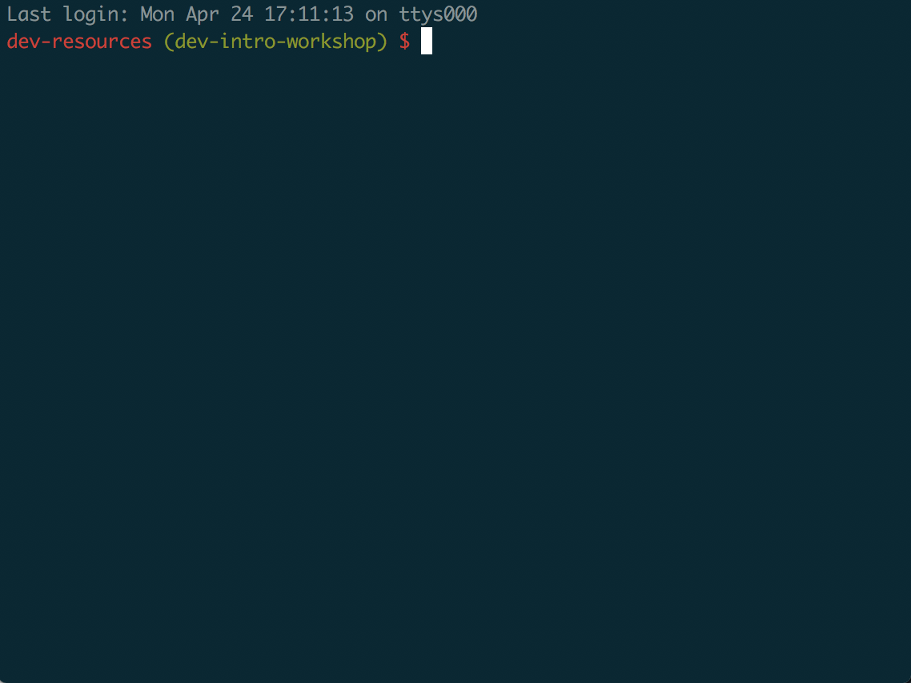
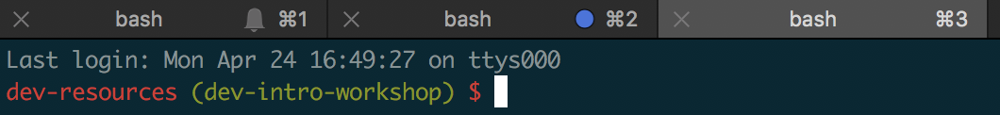
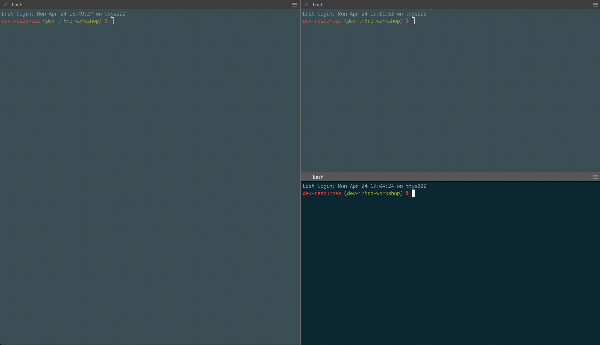
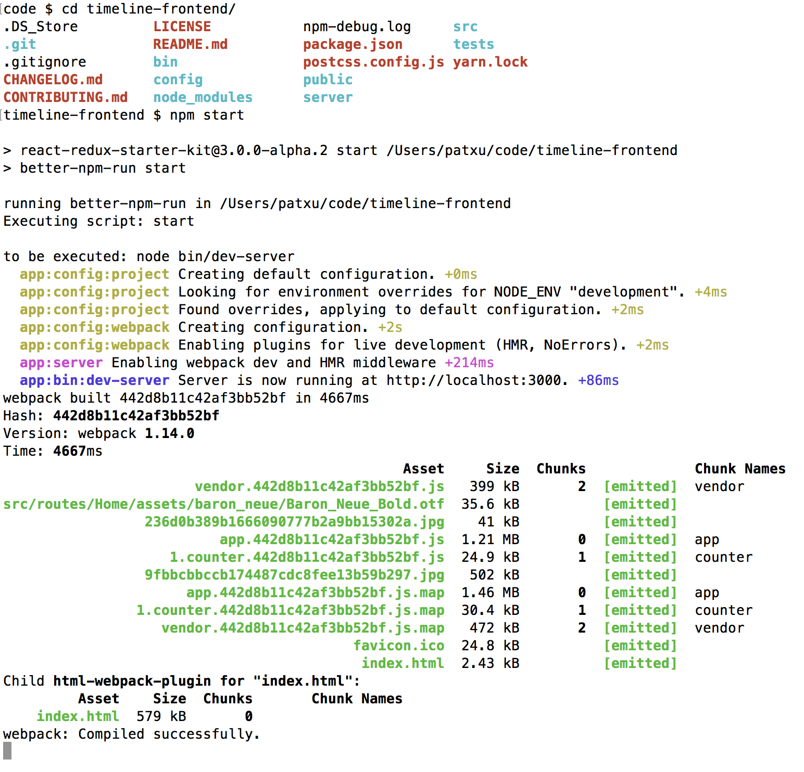
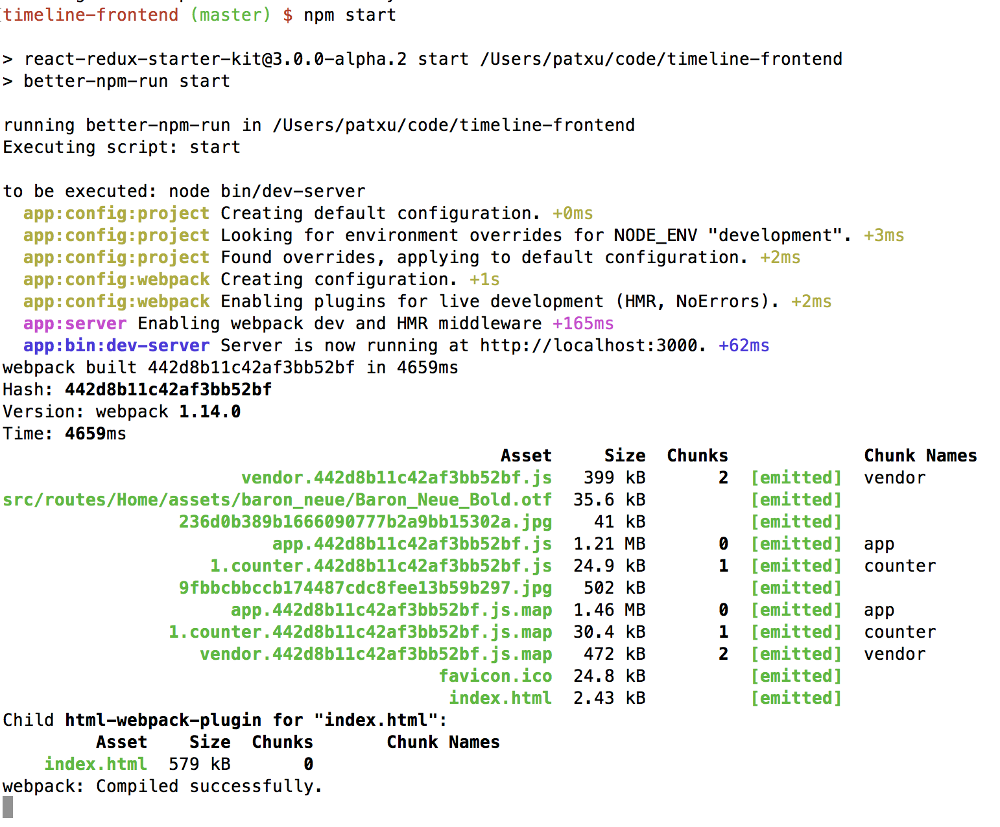
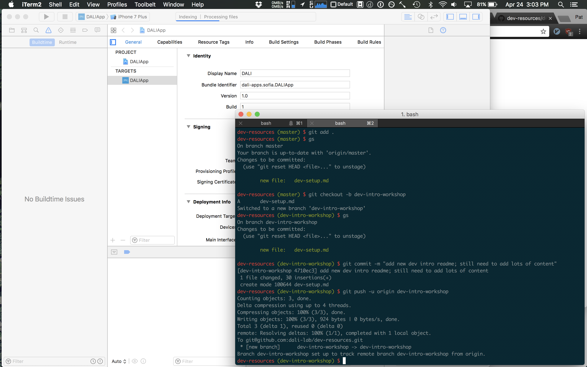
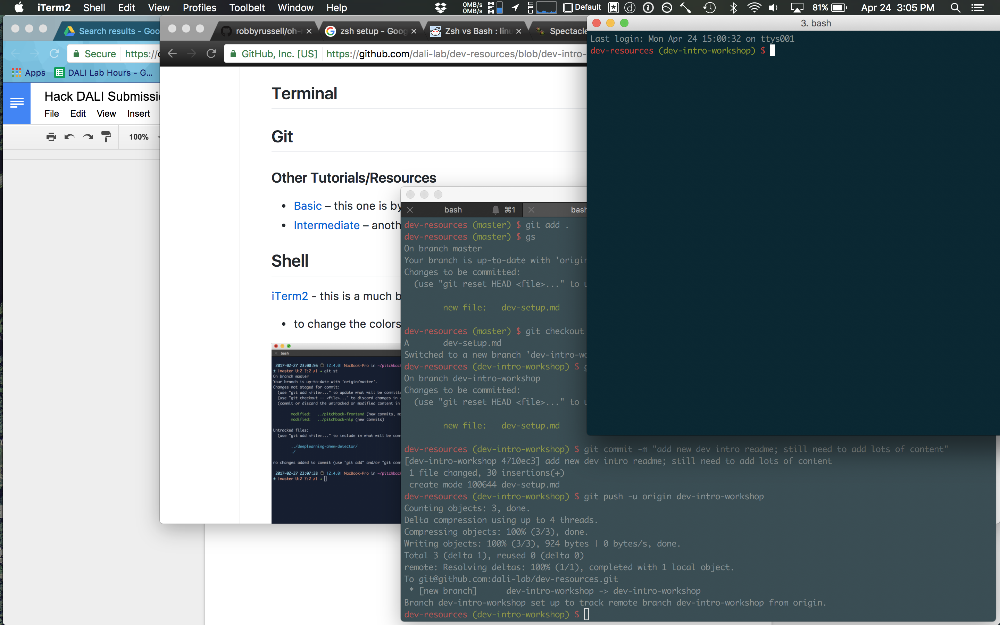
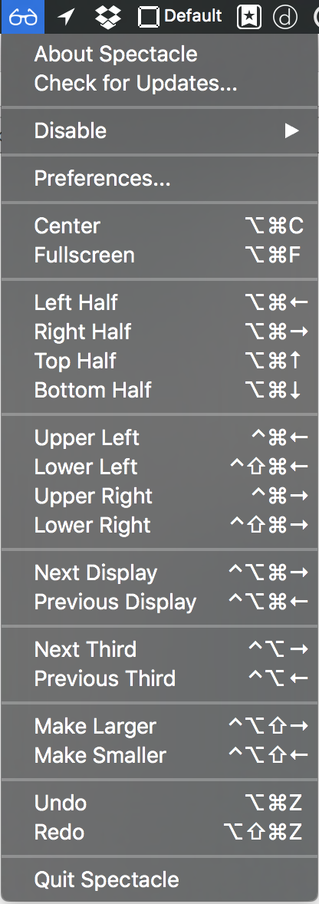
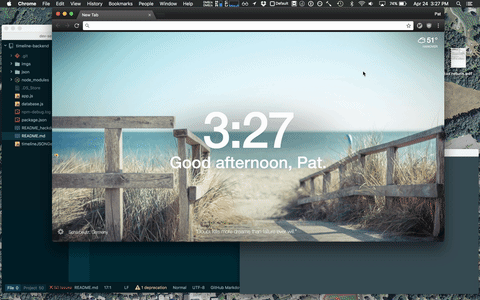

# DALI Dev Tools

##### A guide to a variety of tools that are helpful for devs to improve their workflow

A resource for devs looking to learn dev essentials like: making full use of your terminal, setting up your text editor with all the right addons, mastering git/Github, and efficiently using your screen space.

The common theme across the topics covered here is using your tools efficiently and effectively. You'll start using your keyboard more and your mouse less, making your faster and more precise. You'll be a better developer by being able to collaborate more effectively.

## Topics
- [Terminal](#terminal)
- [Git](#git)
- [Window Management](#window-management)

## Goals
By the end of this, you should have done or be able to:
- create panes and tabs in terminal with a colors command prompt
- use git proficiently – add, commit, push, pull, and pull requests
- move, resize, and switch open applications from the keyboard

## Before Starting
Download:
- [iTerm2](http://iterm2.com) – a better Terminal alternative
- [Spectacle](https://www.spectacleapp.com/) – a window management tool

## Terminal
You'll use the terminal in any and every developer position. From running a server, to using git, to installing packages, having command over your terminal will make you more efficient.

### Why is this important?

So, does your terminal look like this?


*Monochrome terminals are hard to decipher.*


*Separate windows clutter the workspace.*

Compare those with a terminal like this.


It's easy to find your last command, the colors are (subjectively) prettier, and the command prompt has additional information (e.g. git branch name).

### [iTerm2](http://iterm2.com)
This is a much better Terminal command line than the default Terminal.app that comes on your Mac.

- **Change colors:** preferences > profile > colors
  <details>
  <summary>Examples</summary>
    
  </details>
- **Tabs:** ⌘-t
  <details>
  <summary>Example</summary>
  
  </details>
- **Panes**
  - vertical split 👉 ⌘-d
  - horizontal split 👉 ⌘-D
  <details>
  <summary>Examples</summary>
  
  
  </details>


### Customizing Your Prompt

Next, we'll change the color of your command prompt (the line that you type on in iTerm)

<details>
<summary>Difficult to pick out the prompt</summary>

</details>


<details>
<summary>Much easier!</summary>

</details>

If you know that your prompt is a color (red) other than the usual text color, it's much easier to pick out the commands you've entered.

1. Open up your `.bash_profile`
  - `atom ~/.bash_profile`

2. Copy paste these lines in

  ```
  ###### Custom Prompt
  RED="\[$(tput setaf 1)\]"
  RESET="\[$(tput sgr0)\]"
  export PS1="$RED\W $ $RESET"
  ```

3. Open a new terminal window!
4. Continue to customize your prompt as you see fit
  - [adding basic information into your prompt](http://ezprompt.net/)
  - [adding git information](https://coderwall.com/p/fasnya/add-git-branch-name-to-bash-prompt)
  - [here's my full prompt](https://github.com/patxu/dotfiles/blob/master/bash/login/.bash_profile)


## Git
Git is the source control framework that powers Github. Source control is essential as projects grow in size and you work in a team bigger than one. You'll use git to save your work and merge your work with your teammates/coworkers. Finally, Github provides an nice web interface for git and lets you do things like track project progress, jot down issues, and view collaborators. Here's an overview image:


Here's a [basic tutorial](https://try.github.io/) that is beginner-friendly and will get you up started. This will cover things like
  - `git add`
  - `git commit`
  - `git push`

This is a [resource](https://www.thinkful.com/learn/github-pull-request-tutorial/Time-to-Submit-Your-First-PR#Time-to-Submit-Your-First-PR) that covers pull requests.

### Other Resources
- [Intermediate Tutorial](http://rogerdudler.github.io/git-guide/) – another which is less interactive but is still easy to follow and talks about some good commands
- [using Keychain to store your Github credentials](https://help.github.com/articles/caching-your-github-password-in-git/) – clone with HTTPS and save your credentials using MacOS Keychain
- [full git guide](https://github.com/dali-lab/gitivity) – written previously for DALI. the advanced section covers important topics like rebasing
- [better git log](https://coderwall.com/p/euwpig/a-better-git-log) – a more efficient, prettier, and descriptive git log


## Window Management
Window management involves efficiently organizing the windows you have open on your screen. There are two parts to this: making the window the proper size, and sizing it quickly.


### Why is this important?

Does this look familiar?

  

It's incredibly inefficient to work in an environment when you constantly have to go to click through various windows or to use windows that are smaller than they could be (e.g. Xcode, which has a lot of UI elements, should pretty much always be fullscreen).

We're going to use a window management tool **Spectacle** and **⌘-tab** to streamline your workflow.

### [Spectacle](https://www.spectacleapp.com/)
Spectacle is a desktop app that makes window movement and resizing easy. It hides in your top toolbar and has pretty sure everything you'd ask for. This is the easiest window management tool to set up and start using.

Here's a demo of me using it only a couple minutes after downloading it (I use a different resizing tool, which I link below).

 

In a few seconds, I've full screened Chrome, moved my iTerm windows to the upper left and upper right corners of the screen, and moved Atom to the left half of the screen.

### ⌘-Tab
Command-tab (alt-tab on Windows) let's you use your keyboard to switch windows/applications.

1. Hold down ⌘
1. Tap tab
1. You'll see a horizontal list of all open applications, ordered by most recently used
1. Release tab to select the application, **or**
1. Press tab again to select the next application

I demo this in the above gif.

### Other Resources
- [Hammerspoon](http://www.hammerspoon.org/) is a MacOS automation framework and involves writing scripts in Lua to customize your workflow. You can use [my configuration](https://github.com/patxu/dotfiles/tree/master/hammerspoon) to see how I do window management. Send feedback and questions my way!
