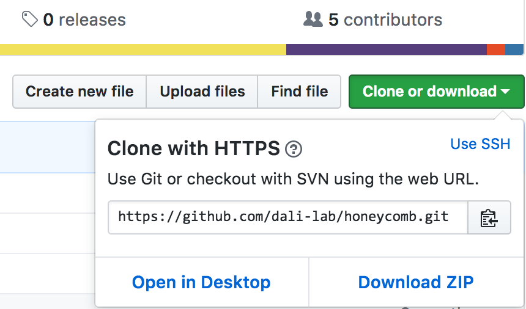
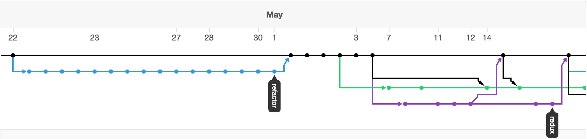
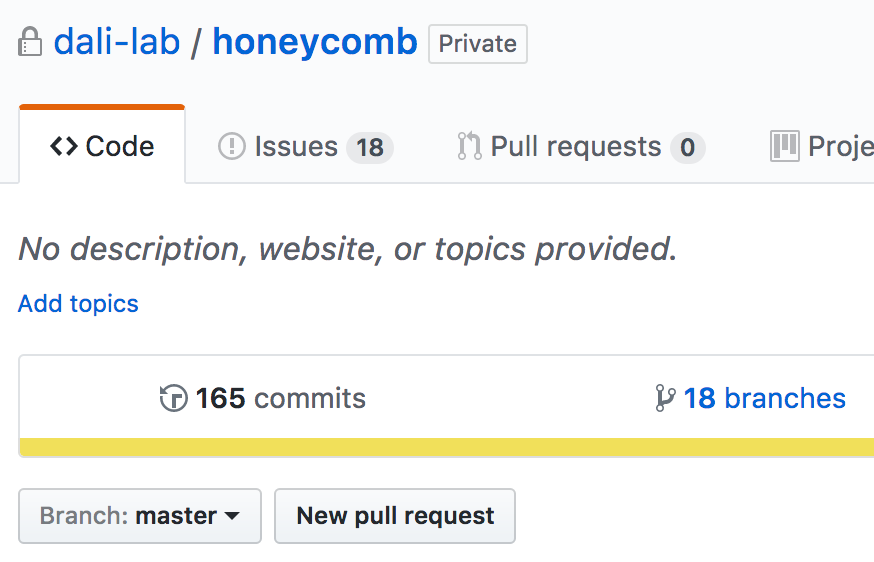
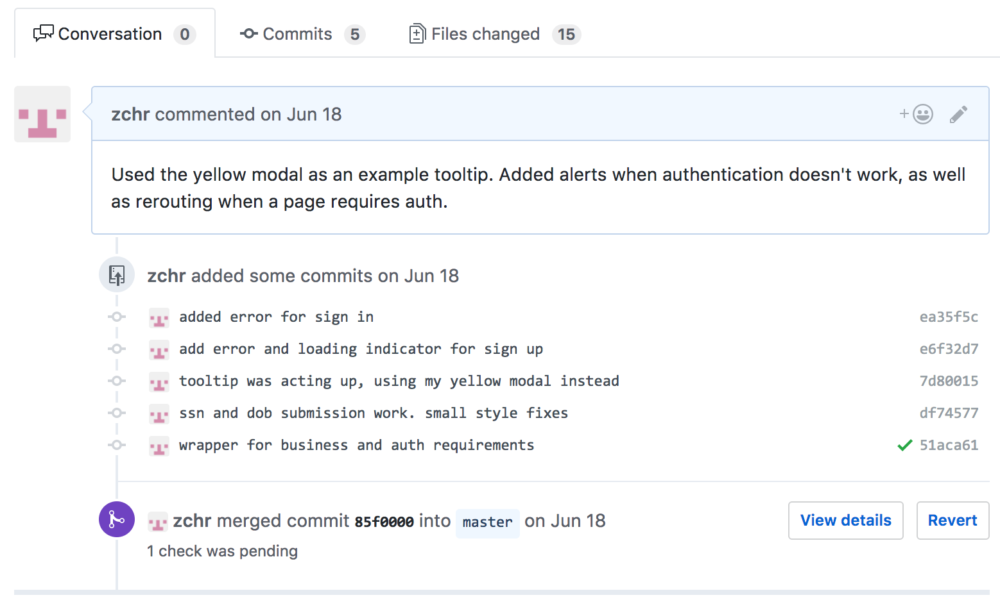
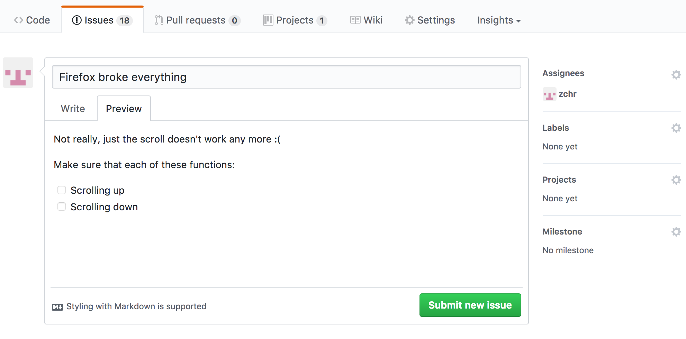
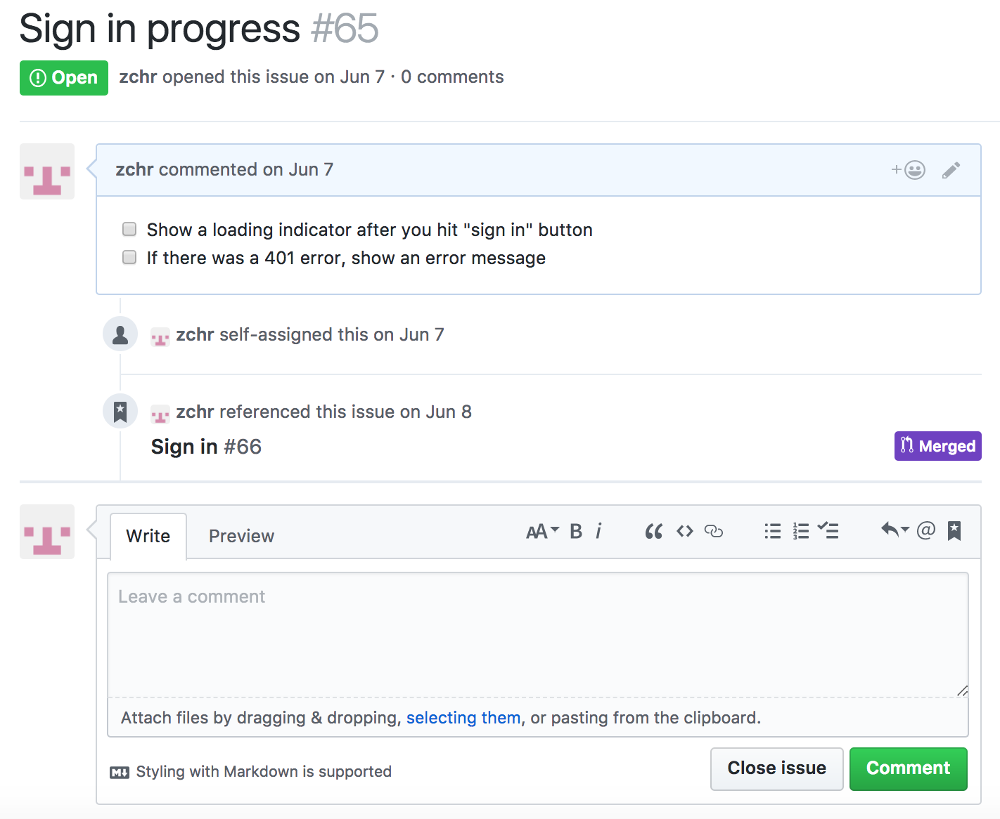

## How to Github

So you want to start contributing code to a project, do you? DALI hosts all projects on GitHub, and, by extension, use git to prevent people from stomping on each other’s feet.

But why do we need to use git, Wise One?  

Because imagine having to tap someone on the shoulder every time you want to edit a file. Or imagine the inevitable case of blechy code necessitating you roll the clock backwards. Git lets you do all of this (not to mention [a](https://git-scm.com/docs/git-fetch) [billion](https://git-scm.com/docs/git-checkout) [other](https://git-scm.com/docs/git-diff) [things](https://git-scm.com/docs/git-stash)).

At this point the project has its very own repository. Maybe it’s empty and you get to add the first lines of code. Or maybe it’s chock-full of code. Doesn’t matter! We emark the same way.

## Step 0: Get set up with GitHub

If you have ever used GitHub from your computer, then you can skip this step. Otherwise, GitHub needs to know that it can trust your computer and your computer equals your GitHub account. They have an excellent overview of that process [here](https://help.github.com/articles/adding-a-new-ssh-key-to-your-github-account/).

## Step 1: Clone the repository.

There ought to be a big ol’ "clone or download" button. It looks like this 

Copy that link. Easy. Now, we want to clone this repository into a folder somewhere on your computer. Open terminal, and, after navigating to the right directory (like your Desktop or your fancy shmancy Dali folder), type git clone <LINK>. Fantastic! Now all of the files are in a folder on your computer. Think of this as a locally stored copy (a clone) of the master project stored in GitHub.

## Step 2: Make a branch  

So that master project I just mentioned? We call that the master branch. Think of the master as the live version of the app. You never want to update the master directly. Rather, all of your changes should go onto a new branch off of master.

That black line? That’s the master branch. When I wanted to make a change, I would create a branch (the blue, green, or purple) and then, once I was sure that my new code was perfect, I could smoosh the changes in my branch back into master. What makes branches so useful is that everyone can work on their own branch! One dev has the green branch, another the purple; we all code without bothering one another.

Now back to making that new branch off master. Back in terminal, use the command git checkout -b <Branch Name>. Now code away and sleep easy that your work exists in a vacuum, incapable of getting ruined by someone else or ruining someone else’s day.

You should make a branch for specific tasks. Building the about page? How about an about branch? Fixing a scroll bug in Safari? How about a safari-scroll-bug branch? These specific names make it easy to keep track of the umpteen branches your project should accumulate. View all of the branches by clicking on this guy: 

## Step 3: Commit your code

Every so often, you want to hit the save button. Git’s way of doing this is called a commit, and GitHub lets you visualize all of them from the Code tab. If you scroll up to look at the image of all of those branches, you will see a bunch of dots. Each one of them represents a commit. And each commit has space to write a handy dandy message to remind future you what on Earth you aimed to accomplish.

You will [make your commits](https://git-scm.com/docs/git-commit) from Terminal, but exactly how depends on whether or not you created new files. Ask around the lab if you need help committing!

(For those keeping score at home, you might have noticed that the branch photo above has some commits in the black, master branch. Minus 10 points for the author.)

## Step 4: Merge your branch

Once you finished updating the about page or fixing that scroll bug, you want to fold your new code back into the master branch. Think of it as making your code live. This process of folding branches together is called, in git speak, merging.

Well, you could just go ahead and merge your branch to master, but that’s pretty rude. If I was a developer on your team, and you just merged your branch on your own, I would probably cry and make you watch.

Instead, use other developers on your team to check your work! The more eyes that see code before it goes live, the less likely your application is to implode. So instead of just merging willy-nilly, let’s run it by the other devs!

We do that in the form of a pull request. This is where GitHub rocks; it facilitates conversations, comments, and note taking. To make a pull request, just visit the tab and click "New pull request"

 

GitHub will walk you through the rest, but it boils down to:

* Choose the branch that you just worked on;

* Add a description of what all you accomplished, maybe any specific questions your have; and

* Add people to review it.

Those reviewer folks will then get to see all of the different commits changes that you made, and they can add marginalia alongside your code. Once approved, go ahead and click "merge" to fold your branch into the master branch.

Now go treat yourself, that was some amazing productivity.

# Now where else does GitHub come in handy?

## Issues

Suppose you’re busy working on that pesky Safari scroll bug, and you notice a horrific scroll issue in Firefox! Gasp!

Well, you could just add the needed fix to the Safari-related branch that you have enslaved over. But that’s lazy! Make this shortcut enough times, and eventually it will be impossible to keep track of where your team made changes.

Instead of dropping your Safari bug pursuit, just add to the GitHub issues, a running list of bugs and features to build out later.

### Step 1: Open an issue

In the Issues tab, click the button to create a new one. You can add subtasks; assign someone to it (maybe yourself since you’ve addressed similar issues before); and even add labels, which make it all the easier to find later.

### Step 2: Close the issue

Fast forward 30 minutes, and you’ve [made a new branch](#heading=h.z37uxrwl6asz) for the issue, [made a pull request](#heading=h.ja1xs9jlhy86), gotten it reviewed, approved, and merged. First off, your team would be the most efficient one ever. Secondly, you just fixed the issue! Now you earned the satisfaction of going back to the issues tab and closing that bad boy.

But say the issue is a bit harder to solve. GitHub leaves room for everyone to write comments and assign other devs. It will even show other places that make mention of this issue.

