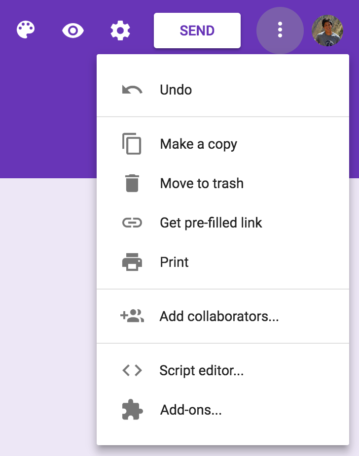
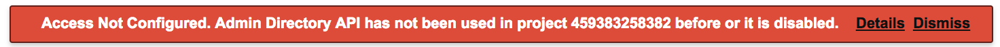

# Developer Guide for DALI's Google Scripts
Author: Pat Xu

## Getting Started
- [Getting Started Guide](https://developers.google.com/apps-script/guides/services/). The advanced section that follows is necessary to get all the configuration right.
- API Endpoints
  - [Inserting Users](https://developers.google.com/admin-sdk/directory/v1/reference/users/insert)
  - [Listing Users](https://developers.google.com/admin-sdk/directory/v1/reference/users/list)
  - [Deleting Users](https://developers.google.com/admin-sdk/directory/v1/reference/users/delete)
    - helpful if you need to test the script and want to create/delete a user repeatedly
- the [Spreadsheet Service](https://developers.google.com/apps-script/reference/spreadsheet/)

## Troubleshooting/Tips
- Make sure the AdminDirectory API is enabled: Resources>Advanced Google Services...
- Access the Script easily from the Form
   
  
- If you get this error, clicking "details" will help you fix it.
   
  
- make sure you give the script full permissions by first running it in the Google IDE
- a lot of errors stem from permission issues. try running the code without any sort of triggers to check if any more permission dialogs pop up
- use a pre-filled Form link to make testing fast
