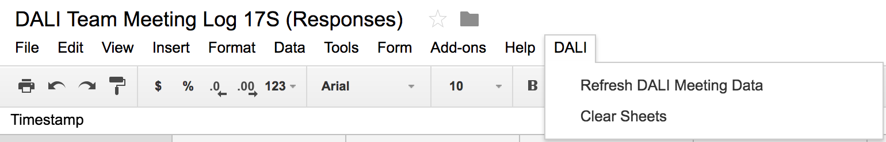
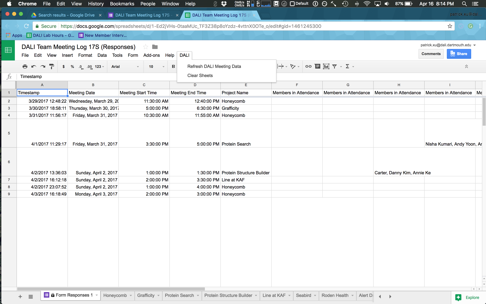

# DALI's Google Apps Script
Author: Pat Xu

At the start of each term we onboard anywhere from a few to a few dozen people. I wrote a couple Google Apps Scripts to help speed up this process. Read on to learn how to use the various tools.

## Table of Contents
- [Onboarding](#onboarding)
- [Meeting Form](#meeting-form)

Developers, [here's](./googlescript-dev.md) a resource for you.

## Onboarding

We use [this](https://docs.google.com/a/dali.dartmouth.edu/forms/d/e/1FAIpQLSfMvbnWtDLdKTxKyPDRRnpkc29yn_YbY8iYDqibNuVxzwfJZA/viewform) Google Form to get new member information. The script uses the information from this form to
1. create an email for the user, and
2. add the user to the upcoming term's Google group

I'll explain in a bit more detail here.

### Creating Emails
- [this script](https://docs.google.com/a/dali.dartmouth.edu/forms/d/e/1FAIpQLSfMvbnWtDLdKTxKyPDRRnpkc29yn_YbY8iYDqibNuVxzwfJZA/viewform) pulls responses from the DALI Personnel Details form and does a few things:
  1. parses for their first and last name
  1. makes a new email `[first].[last]@dali.dartmouth.edu`
  1. creates an email with password "welcometodali"
  1. adds the email to a group called `[term]@dali.dartmouth.edu`
- note:
  - the script runs automatically on form submission

### Adding to the Termly Google Group
- the script will also add the newly created email to the termly Google group via the following method
  - anywhere from week 3 of 17W to week 3 of 17S, someone filling out this form will be added to the 17S@dali.dartmouth.edu group. this obviously extends to later terms
- note:
  - the script pulls the current term from the [DALI Lab Hours](https://docs.google.com/spreadsheets/d/1thFB3xyX5wVN9gdz_K0pk3fUjwLxXIWyJ_rlK7A4TYg/edit#gid=188556850) spreadsheet. make sure this is updated!

### Zapier: Github and Welcome Email
Zapier is also in on the action. It'll take a form submission and
1. invite that user to the DALI Github org, and
1. send the user a welcome email with their email, password, and instructions to set up Slack with their new DALI email

## Meeting Form
There's also a script to help make the [meeting form/log](https://docs.google.com/a/dali.dartmouth.edu/forms/d/1aNwDQS1a1hHOTPYqqyoFWwJ86TKBJB0IRu-kO3piqkM/edit?usp=drive_web) easier to read. This script acts on the response sheet associated with the form.

### Quick Start
1. view the script by going to Tools>Script Editor in the spreadsheet
1. the script pulls responses from the form (specified via form id)
    - make sure to keep the main form questions the same – the script pulls responses based on the name of the meeting date, start/end times, and project name
1. the script creates a menu item in the spreadsheet
    
    - use **Refresh DALI Meetng Data** to create a new sheet for each team that has meeting and attendance data
    - use **Clear Sheets** to remove all sheets except for the original one. note: refreshing the sheets will automatically remake all the sheets
    
