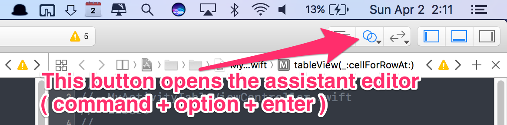

# A DALI guide - Native iOS Development Resources

I’ve only included the essentials in this guide. There is certainly more to say about each topic, but after 2 years of iOS development, these are the ideas that I feel are most important.

## Getting Started

### Tutorials

I got started with the **[Lynda.com iOS tutorials](https://www.lynda.com/learning-paths/Developer/become-an-ios-10-app-developer)**. These tutorials will give you a good introduction to both Swift and iOS development. The rest will come through your own hacking with liberal use of Stack Overflow. I've found it helpful to tack on 'Swift' at the beginning of all google searches ensure the results are appropriate. 

https://www.raywenderlich.com is also an excellent source of written iOS tutorials. 

### XCode and Setup

##### Screen
Use an external monitor! Xcode uses multiple panes and inspector windows that quickly crowd your actual coding space. Using a large external monitor will alleviate this issue and speed up your workflow considerably. I would also recommend liberal use of the assistant editor as it allows you to have two files open at once. 



##### Source Control
Xcode also has a really nice git interface that’s easy to use and can help you handle commits and merges. Get started with that in the 'Source Control' menu. 

Merging swift files is the same as merging any other code-based project. The one aspect of iOS dev git flow you need to be careful about is storyboard merge conflicts. The graphical elements of the storyboard are translated into a markup language that is very difficult to debug. To circumvent this problem I would recommend not having more than one person working on a given storyboard file at a time. This is one of the best reasons to break apart your application into multiple storyboard files. 

##### Commonly used shortcuts;
 * **cmd + r** to build. Faster than physically hunting for the play button each time.
 * Holding down option and clicking any file will open the file in assistant editor window instead of the main editor window
 * **control + command + j** to jump to the definition of a variable. 
 * **comand + shift + o** to open files quickly. Much faster when you have a lot of files and you know which one you want. 

### Debugging

##### Tutorial
[Here](https://www.natashatherobot.com/swift-debugging/) is a good tutorial about debugging that will save you much more time than it takes to read. 

##### Tips
 * You can actually add breakpoints to your code AFTER you’ve deployed it to the simulator or to your device. This allows you to print out variables in the console with 'po' without having to put print statements in your code and re-compiling. When you’re dealing with 1min+ compile times this will save you hours of dev time. 

 * For some reason Xcode 8 spits out tons of garbage in the console for no reason. Disable it by following the instructions from the top answer [here](http://stackoverflow.com/questions/37800790/hide-strange-unwanted-xcode-8-logs)

### Misc advice

##### IBOutlets
Be careful when renaming/removing variables that are attached to storyboards via IBOutlets! If the connection is not also removed your app will crash and you will get a very cryptic “key" error that will take you hours to debug if you haven’t seen it before.


##### Be safe! (Un)Wrap it up!
Unwrapping options (using !) is very dangerous. I know they’re tempting to use since they cut down on the amount of code you have to write. Unwrap with extreme caution and err on the safe side. On that note, learn when to use the ‘guard’ statement to unwrap as it can provide code style improvements over ‘if let’.  

**[Here](https://ericcerney.com/swift-guard-statement/)** is a very concise tutorial about if-let and guard statements. 

##### Multiple storyboards

There are many benefits that come with breaking apart your storyboard files
* Better organization, reduces clutter
* Circumvents nasty storyboard merge conflicts
* Multiple people can simultaneously work on UI

**[Here](https://www.newventuresoftware.com/blog/organizing-xcode-projects-using-multiple-storyboards)** is a tutorial that illustrates this process.

#### Segues

Segues are much, much cleaner if defined pragmatically. 

I personally don’t enjoy the PrepareForSegue paradigm. In my opinion is breaks the flow of the code by moving your segue logic to another location in the file. I also find that the arrows generated by segues defined in Storyboard to generate a lot of clutter with large applications. You should definitely take the time to organize your storyboards in a logical way that makes the destination of the segues obvious. 

Here’s the flow I would recommend. 
```swift
//I would recommend making this a static variable so you have access to it in all files across the lifecycle of the app for all segues
let mainSB = UIStoryboard(name: "Main", bundle: nil)

//make sure to set the identifier in storyboard
if let destinationVC = mainStoryboard.instantiateViewController(withIdentifier: “destination”) as MyViewController {
  //pass through the information 
  destinationVC.someInteger = 5
  destinationVC.someString = “derp”

  //make the segue
  self.present(destinationVC, animated: true, completion: nil)
  //or use "myNavController.pushViewController(destinationVC, animated: true)” when you’re in a navigation stack 
}
```

## External Libraries and Cocoapods

##### [Cocoapods](https://cocoapods.org)
If you didn’t know about cocoapods, you’re welcome. Cocoapods gives you easy access to the wealth of open-source libraries available for native iOS development. Get started with the guide here

##### Tips
* If you’re having trouble understanding how to use a library, download the example app on the library's GitHub page and play around with that in Xcode to see how it works. 
* Sometimes after running pod install Xcode won’t recognize the new library until you run a clean (shift + command + k or Product -> Clean)

### Swift Cocoapods

https://github.com/matteocrippa/awesome-swift

This page is your best friend. Bookmark it, immediately. This page makes it easy to find perfect cocoa pod extensions for your application. There are so many wonderful open-source libraries to use it almost feels like you're at a candy store where everything is free. Before spending a significant amount of time write code for any feature, consult this page to see if someone else has already written it for you (hint: they probably have). 

Here are the essentials (aka non-optional for most projects):

**[Alamofire](https://github.com/Alamofire/Alamofire)** - HTTP networking (get, post, etc) in Swift. Basically the industry standard. Use it, learn it, love it. 

**[SwiftyJSON](https://github.com/SwiftyJSON/SwiftyJSON)** - Parse and handle JSON. Handles optionals elegantly. Use this library in conjunction with responses generated from Alamofire. 

**[DZNEmptyDataSet](https://github.com/dzenbot/DZNEmptyDataSet)** - Empty table views are bad, ugly, and uninformative. This library fixes all of those issues by handling the “empty table state”. In my opinion handling the blank state is the single best investment you can make to elevate the usability and design of your app. Unfortunately, set up is a little tricky since it’s not a native Swift library, but there is a great tutorial **[here](https://www.hackingwithswift.com/example-code/libraries/how-to-make-empty-uitableviews-look-more-attractive-using-dznemptydataset)**. Get fancy with buttons, images and animations. 

**[Former](https://github.com/ra1028/Former)** - Most apps will need user input that requires more than a simple text input at some point or another. User signups and creating a new posts are two common examples. However, laying out a form by hand is time consuming and clunky to adapt for all screen sizes. 
Former makes it easy to create forms to collect this input. it comes with many useful animated "rows" such as DatePicker and Slider. 

**[SCLAlertView](https://github.com/vikmeup/SCLAlertView-Swift)** - A well-designed and easy to use alert for iOS that makes it easy to present a user with choices, alerts, errors, etc. Also handles text input. 

## Design

Your iOS app is *ugly*. And if it doesn’t exist yet it will be. Apologize to the design gods for your sins. The worst mistake beginning mobile designers make is not taking the time to understand the design principles and conventions specific to iOS design. Take the time to go through the apps you use on a daily basis (ignore facebook and snapchat) and think about their interaction patterns, UI elements and UX flow. Apple’s own apps are a good place to start. Study iOS UI components like table views, collection views, pickers, buttons, segmented controllers, and formulate patterns about when it’s necessary to use each one. 

##### Recommended Reading
https://developer.apple.com/ios/human-interface-guidelines/overview/design-principles/

##### Inspiration
Especially as a beginner, your collection of inspiration is the most important indicator of how successful your designs will be. There is no point in reinventing the wheel when the collective community has put in millions of hours into exploring effective mobile UI design. 

Here are three places to start:
* **[Pinterest1](https://www.pinterest.com/emxpi/ios-inspiration/)**
* **[Behance](https://www.behance.net/search?field=132&content=projects&sort=appreciations&time=month&user_tags=972119)**
* **[Pinterest2](https://www.pinterest.com/severinerx/ios-inspiration/)**

Don’t be afraid to directly copy elements from these inspiration grids. Originality will come in time with practice. 

##### Tools
**[Sketch](https://www.sketchapp.com)** has everything you need and is tailored to this type of UI design. Ask Tim for a license if you'd like one. 

##### Mockups
I've found that placing your designs in an iPhone render is a great way to increase visual impact in presentations. Here’s a good, free iPhone 6/7 render: http://www.pixeden.com/psd-mock-up-templates/iphone-6-psd-vector-mockup.

##### Icons
**[Prepo](https://itunes.apple.com/us/app/prepo/id476533227?mt=12)** is a free app that automatically takes your icon and exports it in all the appropriate sizes. Saves a ton of annoying photoshop/sketch exports. 


This document is still a work in progress. Feel free to edit this document with your own favorite xcode practices! 
