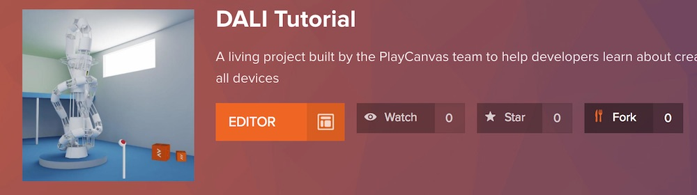
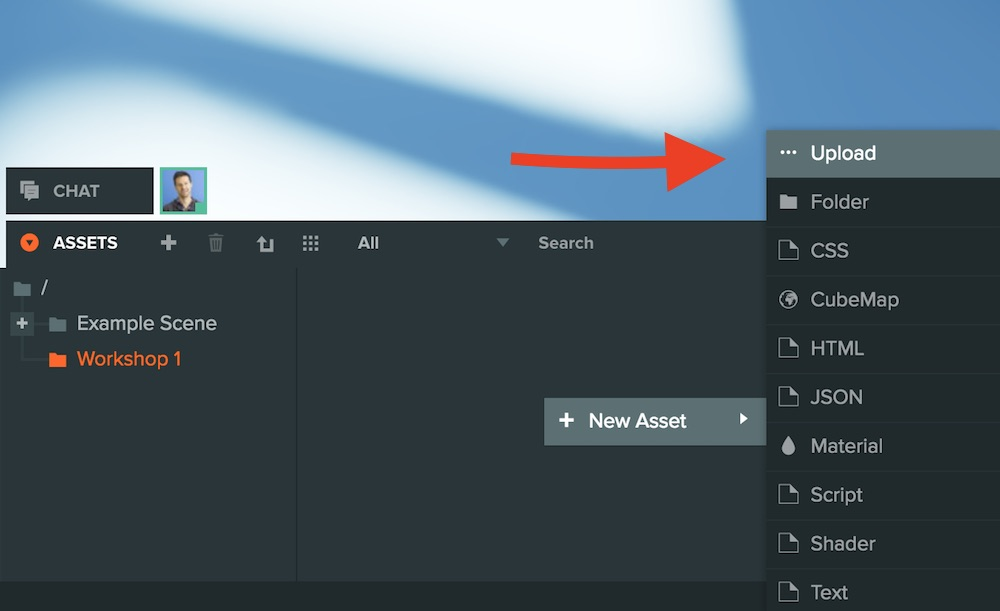
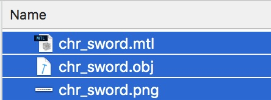
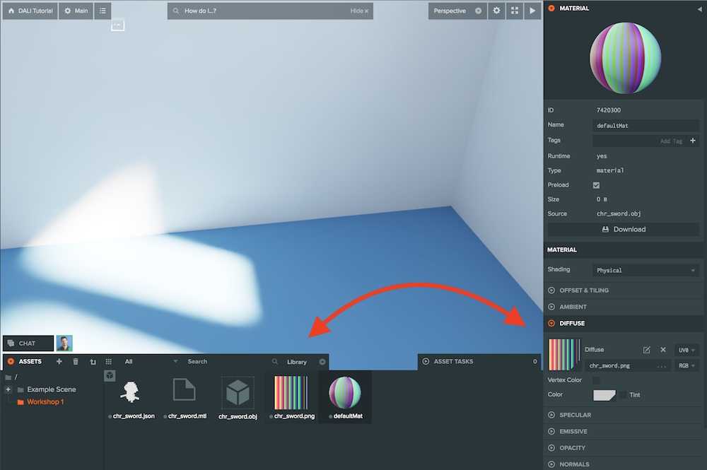
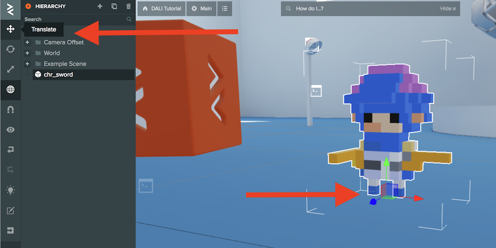
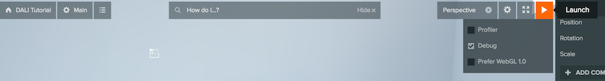
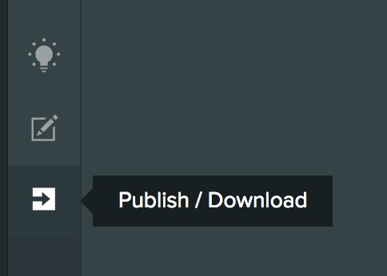
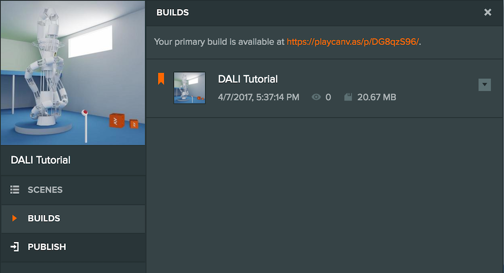
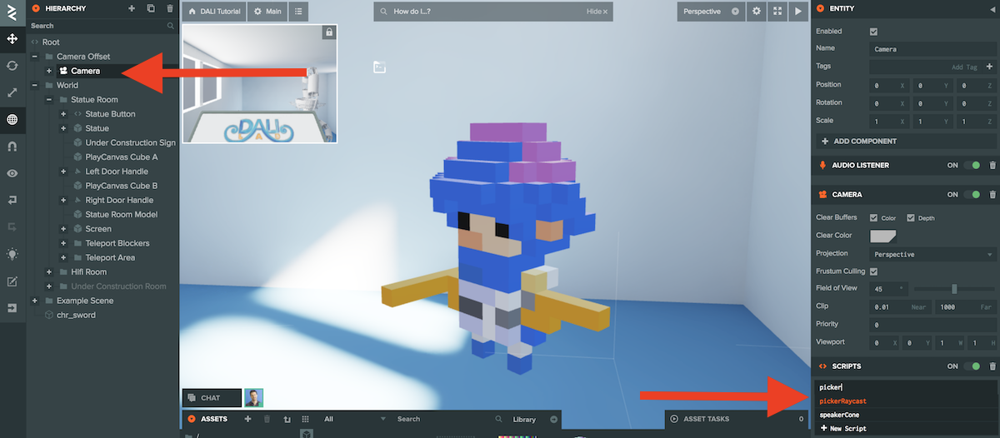
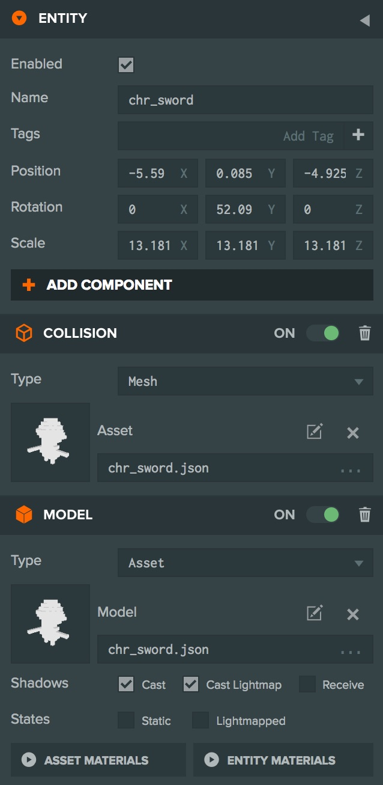

WebVR is a new standard that is rapidly developing. We'll play with a few technologies and make a tiny world with some moving parts with Google Cardboard.

{: .small .fancy}


## Building Assets

What is a game without some cool environment and assets?  So first thing we'll play with building some stuff.

<iframe src='https://cartrdge.com/exmachina/voxel-seamonster/embed' frameborder='0' scrolling='no' width='640' height='360' allowfullscreen></iframe>

[magicavoxel]: https://ephtracy.github.io/

[MagicaVoxel][magicavoxel] is a free and user-friendly tool for building
3D scenes and models using *voxels* (i.e., blocks). MagicaVoxel makes modeling super
easy, similar to building in Minecraft.

{: .medium .fancy}

## Installation

🚀 MagicaVoxel works on Windows and OS X. On the [MagicaVoxel
homepage][magicavoxel], click the *Download* button and install the application:

{: .medium .fancy}

On macOS, open the MagicVoxel app file by clicking on it in Finder. Initially,
you will see a message noting that you cannot open applications from
unidentified developers. After dismissing that message, open the
*Security & Privacy* settings pane and click "Open Anyway" on the MagicVoxel app:

{: .medium_small .fancy}

Alternatively, you can find the MagicVoxel app file in Finder, right click on it,
and then choose "Open" from the shortcut menu. In the subsequent dialogue
click "Open" again. For more information, visit [Apple's documentation](https://support.apple.com/kb/PH25088?locale=en_US) on unidentified developers.

## Tutorial

The official tutorial video serves as a good introduction to using MagicaVoxel.
The author quickly runs through many basic features in 10 minutes:

<iframe width="560" height="315" src="https://www.youtube.com/embed/PPu7SJ1_bwc" frameborder="0" allowfullscreen></iframe>

🚀 The best way to learn the MagicaVoxel UI is to click around, play with application controls,
and pay attention to the tooltips on hover. Many developers are able to create their first
scene within a half hour!  Given the absence of official tutorials, however,
the following serves as a quick guide to navigating the UI.

### Viewport

The center panel hosts the viewport where we build our model. We can change the
viewport our mouse/trackpad or the `wasd` keys:

- **Pan**: Hold `<space> + <right-click>` and move the mouse or trackpad, or
  hold `<space>` and press one of the `<a>` or `<d>` keys.
- **Rotate**: Hold `<right-click>` and move the mouse or trackpad, or press one
  of the `<a>` or `<d>` keys.
- **Zoom**: Scroll up and down with the mouse or trackpad, or press one of the
  `<w>` or `<s>` keys.

{: .medium .fancy}

The top right corner of the viewport allows you to change the bounding dimensions
of the model. Note that in MagicaVoxel, the XY plane is horizontal and the Z
axis points up.

### Color Palette

The left panel is the color palette. You can use the default palettes,
modify them, create your own, and save them. The palette is tied to the scene
so if you change from the palette a color that a voxel is using, the voxel will
update its color. At the bottom, there are tools to define your own color with
sliders or via copying and pasting hex or rgb values:

{: .medium .fancy}

### Brushes

The brushes panel is to the right of the color palette. Brushes add, erase, or
paint voxels in various shapes, sizes, and patterns. With a brush selected,
simply click in the viewport on your model to use it:

{: .medium .fancy}

There are six brushes:

- **V (Voxel)**: Works on individual or discrete groups of voxels.
- **F (Face)**: Works on groups of adjacent voxels that are the same shape or color.
- **B (Box)**: Works on a 2-dimensional box of voxels where we control the area
  of the box by dragging.
- **L (Line)**: Works on a 1-dimensional line of voxels where we control the
  length of the line by dragging.
- **C (Center)**: Works on a circle or square of voxels where we control the
  radius of the shape by dragging.
- **P (Pattern)**: The pattern brush lets us use other MagicaVoxel models and paste them
  into the current model. Useful for placing repeated shapes.

### Actions

There are four actions that work in conjunction with the brush type:

- **Attach (t)**: Add voxel(s).
- **Erase (r)**: Remove voxel(s).
- **Paint (g)**: Change color of existing voxel(s).
- **Move**: Moves entire model. Unfortunately, there is no way to select
  individual voxel(s) to move.

{: .medium .fancy}

Below the actions are three color picking tools to pick, remove, and place
color. It is useful to know the `<alt> + <click>` shortcut to select a color by
clicking on a voxel.

## Make Something

Now that you have some idea of how to use MagicaVoxel try making something, or preload a model and alter it!

{: .medium .fancy}


## Export Your Creation

When you are ready, export your amazing creation to `Obj` format - save it somewhere you can find. This will generate 3 files for you.  

* `.obj` is the 3D object as a set of vertices and faces
* `.mtl` is the material for the object, and contains how the texture should map to the surface of your object
* `.png` is the texture, in this case an image with lots of different color corresponding to the colors of the voxels.

{: .medium .fancy}


# PlayCanvas

Now we want to share our work with the world and put it into a VR environment!

[pc]: http://playcanvas.com


One way to do that is to use [PlayCanvas][pc].  [PlayCanvas][pc] is a full featured 2d/3d game engine for creating interactive content for the web.  They recently added WebVR support and will do very nicely for our purposes.

<iframe src="https://s3-eu-west-1.amazonaws.com/apps.playcanvas.com/Ppfa6E7q/index.html" webkitallowfullscreen="true" mozallowfullscreen="true" allowfullscreen="true" allowvr="" width="640" height="360" id="playcanv"></iframe>

🚀 Go create an account now (free)!

🚀 PlayCanvas allows you to remix other public projects. Let's **Fork** our [VR starter project](https://playcanvas.com/project/473127/overview/dali-tutorial).


[{: .small .fancy}](https://playcanvas.com/project/473127/overview/dali-tutorial)


## Get Familiar with the interface

PlayCanvas has similar controls to MagicaVoxel.  Here's a rundown of the interface.

{: .medium .fancy}

* **Menu:** The menu contains all the commands available in the Editor. If you can't find the button or remember the hotkey, use the menu.
* **Toolbar:** Commonly used commands are available on the toolbar for quick access.
* **Hierarchy:** A hierarchical view of the Entities that make up the open Scene. Use this to select, delete and re-parent Entities.
* **Inspector:** Detailed properties of the selected Entity, Asset or Component.
* **Viewport:** A 3D view onto your scene, use this view to select, position and orientate Entities.
* **Assets:** A view of all the Assets in the current Project. You can search for assets by name, filter by type and also drag and drop assets to various slots or in the Design View.


## Let's Import!

🚀 Open the `Workshop 1` folder in the Assets Pane and right click inside it to **upload** your model.

{: .small .fancy}

Select all **3** of the files you exported earlier.

{: .small .fancy}

PlayCanvas will upload and then create 2 more files in the Assets area.

* `.json`: this is the actual model used by the webgl viewer that is created from the `.obj` file.
* `defaultMat`: this is the material that will be loaded onto the model.

When you first upload the `defaultMat` will appear grey.  You will need to assign the `png` file to the `DIFFUSE` channel in the Inspector (on the right side).

🚀 Select the `defaultMat` and open the `DIFFUSE` channel.
🚀 Drag the `.png` file onto it.

{: .medium .fancy}

🚀 Now to place your model into the scene just drag the `.json` file onto the scene.  If you can't see the model just hit `f` and you zoom into it.  `f` always centers the view on the selected object.

🚀 Then use the translate, scale, and rotate tools to move your object around.

{: .medium .fancy}


## Test It With Cardboard

You can test play your scene with or without Google Cardboard.

To test without just click the play button!

{: .fancy}

To test it with the cardboard you'll need to do an extra step and publish it.

{: .tiny .fancy}

Then just go to the generated published URL on your phone and you should be able to experience your world in all of its VR wonder.

{: .medium .fancy}


## Code

The next thing to play with is adding functionality through code!   PlayCanvas has a large API and you can script pretty much anything in your scene.

Let's add a collision detector to your object and have it react to touches!

🚀 In your Assets folder, right click and create 2 new *Scripts*.

Name one `pickerRaycast` and then double click and add the following code.

```javascript
var PickerRaycast = pc.createScript('pickerRaycast');

// initialize code called once per entity
PickerRaycast.prototype.initialize = function() {
    this.app.mouse.on(pc.EVENT_MOUSEDOWN, this.onSelect, this);
};

PickerRaycast.prototype.onSelect = function (e) {
    var from = this.entity.camera.screenToWorld(e.x, e.y, this.entity.camera.nearClip);
    var to = this.entity.camera.screenToWorld(e.x, e.y, this.entity.camera.farClip);

    this.app.systems.rigidbody.raycastFirst(from, to, function (result) {
        var pickedEntity = result.entity;

        pickedEntity.script.pulse.pulse();
    });
};
```

Then do the same with another script named `pulse`.


```javascript
var Pulse = pc.createScript('pulse');

// initialize code called once per entity
Pulse.prototype.initialize = function() {
    this.originalScale = this.entity.getLocalScale().x;
    this.factor = 0;
    this.entity.on('controllertrigger:activated', this.pulse, this);
    this.entity.on('object:interact', this.pulse, this);

};

Pulse.prototype.pulse = function () {
    this.factor = 1;
};

// update code called every frame
Pulse.prototype.update = function(dt) {
    if (this.factor > 0) {
        this.factor -= dt;
        var s = this.originalScale + Math.sin(this.factor * 30) * this.factor;
        this.entity.setLocalScale(s, s, s);
    }
};
```

🚀 Find the Camera object and add the `pickerRaycast` script to it.

{: .medium .fancy}

🚀 In the same way add the `pulse` script to any object in the scene that you want to pulse.

Once you've done that you will also need to add a Collision component to those objects.

🚀 Select your object, click *Add Component*, choose Collision, set the *Type* to Mesh and drag in your objects `.json` file into the Asset field.

{: .small .fancy}

Now if you test scene you should be able to click or select and object and it'll giggle at you!


Here's [more about getting started with coding](http://developer.playcanvas.com/en/getting-started/) in PlayCanvas.

## More Stuff To Try

* Try incorporating an [explosion](https://playcanvas.com/project/439297/overview/explosion-particle-effect) somewhere!
* [Lots More Tutorials](http://developer.playcanvas.com/en/tutorials/)


#### References

* MagicaVoxel section remixed from [aframe.io](https://aframe.io/docs/0.5.0/guides/building-with-magicavoxel.html), aframe is another WebVR platform that is up and coming. It isn't as full featured of a game engine as PlayCanvas though.
* PlayCanvas [Manual](http://developer.playcanvas.com/en/user-manual/vr/)
